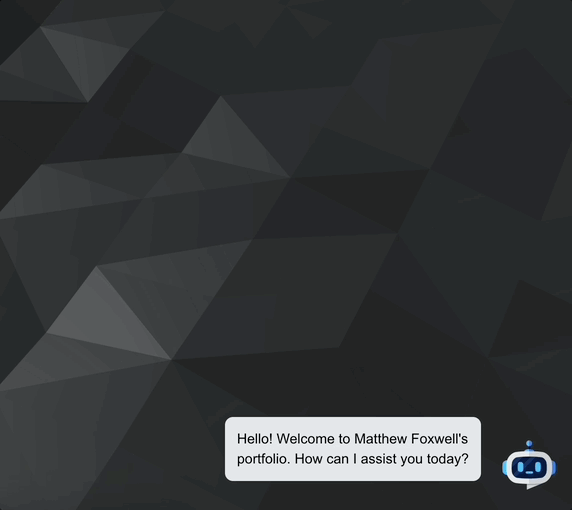

# 💼 Matthew Foxwell — Developer Portfolio

Welcome to my personal portfolio site! This project showcases my work, skills, and background as a software developer with a focus on React, TypeScript, and responsive design that adapts seamlessly to changing screen sizes.

Built with modern tools and a clean UI/UX, the site includes a RAG-based AI chatbot using OpenAI, project highlights, an interactive map of places I’ve lived around the world, and a contact form.

---

## 🖼️ Preview

<p align="center">
  
  
</p>

<p align="center">
  
</p>

---

## 🚀 Tech Stack

- **Frontend**: React, Next.js 15, Tailwind CSS, TypeScript
- **AI Chatbot**: Supabase, OpenAI, Langchain
- **Map**: Mapbox GL JS
- **Deployment**: Vercel

---

## 🛠️ Running Locally

```bash
git clone https://github.com/your-username/portfolio.git
cd portfolio
npm install
npm run dev
```
